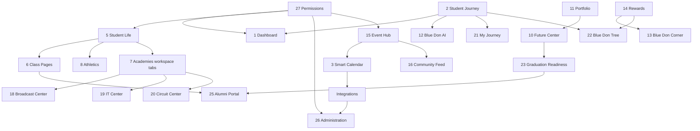

# 05 — Roadmap

**Version:** 0.2  
**Scope:** Phased build order for platform modules 1–27  
**Basis:** Logical dependencies only — **no calendar dates**  
**Supersedes:** `27_ROADMAP_PHASES_16_PLUS.md` (legacy pointer)

---

## Roadmap Principles

1. **Permissions and orgs first** — Module 27 and workspace model unblock most other modules.
2. **No duplicate builds** — Extend Phase 0–15 assets (academies, calendar, portfolio, service desk) rather than rewrite.
3. **One phase at a time** — Stop for approval per existing phase discipline (B1).
4. **Blueprint section required** — Each phase references A1–A6 before code.
5. **IA migration is its own phase** — Nav restructure after stakeholder approval of [03_INFORMATION_ARCHITECTURE.md](./03_INFORMATION_ARCHITECTURE.md).

---

## Dependency Graph (Simplified)

---

## Phase 16 — Permissions & Organization Foundation

**Goal:** Unlock the organization layer and 14-role access model.

| Order | Module | Deliverables |
|-------|--------|--------------|
| 16.1 | **27 Permissions System** | 14 roles in `roles.ts`; org-scoped permission keys; parent–student linkage schema; service-layer enforcement patterns |
| 16.2 | **5 Student Life / Clubs** | `Organization` model; workspace template v1; club directory; `/orgs/[slug]` routes |
| 16.3 | **6 Class Pages** | Org type `class`; graduating year provisioning |
| 16.4 | **8 Athletics** | Org type `team`; team workspace (roster, schedule shell) |

**Exit criteria:** Club and team workspaces live; roles enforce org access; no new top-level nav yet.

---

## Phase 17 — Navigation & Dashboard Repositioning

**Goal:** Ship enterprise IA and role-personalized home.

| Order | Module | Deliverables |
|-------|--------|--------------|
| 17.1 | **IA migration** | `navigation.ts` v2 — twelve destinations; redirects from old routes; mobile role shortcuts |
| 17.2 | **1 Personalized Dashboard** | Role templates (student grade bands, parent, teacher, admin); widget priority config |
| 17.3 | **4 School Hub** | Hub shell; absorb Knowledge Vault; announcements, bell schedule MVP |
| 17.4 | **26 Administration Center** | Promote `/admin` to primary nav "Administration" |

**Exit criteria:** Sidebar shows enterprise labels; old routes redirect; dashboard differs by role.

**Depends on:** Phase 16 permissions; IA stakeholder approval.

---

## Phase 18 — Event Engine & Smart Calendar

**Goal:** Unified time layer and publish-everywhere events.

| Order | Module | Deliverables |
|-------|--------|--------------|
| 18.1 | **15 Event Hub** | `EventPublication` model; cross-surface publish (calendar, org, feed stub) |
| 18.2 | **3 Smart Calendar** | Multi-source aggregation UI; color-coded sources; dashboard widget upgrade |
| 18.3 | Integrations (partial) | Google Calendar read sync; Classroom due dates (read-only) |

**Exit criteria:** One event creation publishes to calendar + org page; Google Calendar import works.

---

## Phase 19 — Student Journey Layer

**Goal:** Longitudinal profile and narrative views.

| Order | Module | Deliverables |
|-------|--------|--------------|
| 19.1 | **2 Student Journey** | About Me profile; grade level; milestone schema |
| 19.2 | **21 My Journey** | Timeline UI; journal entries; filter by domain |
| 19.3 | **22 Blue Don Tree** | Visual growth component; branch mapping; dashboard widget |

**Exit criteria:** 7th grader can complete About Me; timeline shows academy + service milestones.

---

## Phase 20 — Future Center & Portfolio Depth

**Goal:** Post-secondary planning and professional evidence.

| Order | Module | Deliverables |
|-------|--------|--------------|
| 20.1 | **10 Future Center** | MVP tabs: career, college, trade, military, scholarships |
| 20.2 | **11 Resume & Portfolio** | Resume builder; PDF export; certification auto-fill |
| 20.3 | **23 Graduation Readiness** | Senior checklist; deficiency alerts; Future Center links |

**Exit criteria:** Senior can track graduation requirements and export resume from portfolio.

---

## Phase 21 — Rewards & Community Economy

**Goal:** Motivation layer and positive social surface.

| Order | Module | Deliverables |
|-------|--------|--------------|
| 21.1 | **14 Rewards System** | XP ledger, Blue Don Coins, badges, streaks, teacher grants |
| 21.2 | **16 Community Feed** | Positive feed, kindness actions, moderation queue |
| 21.3 | **13 Blue Don Corner** | Marketplace listings; org stores; coin checkout |
| 21.4 | **8 Blue Don Corner nav** | Community + Marketplace tabs under one destination |

**Exit criteria:** Students earn coins from activities; staff moderates feed; marketplace listing with approval.

---

## Phase 22 — Blue Don AI

**Goal:** Mentor AI across journey, career, and academies.

| Order | Module | Deliverables |
|-------|--------|--------------|
| 22.1 | **12 Blue Don AI** | Global `/ai-assistant`; guardrails; logging |
| 22.2 | Journey AI mode | About Me + milestone-aware recommendations |
| 22.3 | Career AI mode | Future Center scoped mentor |
| 22.4 | Academy coaching | Replace learning-flow placeholder |

**Exit criteria:** Live AI assistant with disclaimer; journey and career modes; academy hints wired.

**Depends on:** Phase 19 (About Me), Phase 20 (Future Center shell).

---

## Phase 23 — Service Center & Operations Expansion

**Goal:** Complete service and volunteer tracking.

| Order | Module | Deliverables |
|-------|--------|--------------|
| 23.1 | **9 Service Center** | Rename/rebrand; facilities category |
| 23.2 | Volunteer module | Service hours log; supervisor approval |
| 23.3 | QR check-in/out | Event-linked hour capture |
| 23.4 | **19 IT Center** | IT-branded queue; device tracking shell |

**Exit criteria:** Volunteer hours tracked with QR; IT Center distinct from generic desk.

---

## Phase 24 — Academy Centers & Engine Completion

**Goal:** Operational centers and engine persistence gaps.

| Order | Module | Deliverables |
|-------|--------|--------------|
| 24.1 | **7 Academies** | Workspace tabs; progress persistence; assessment engine |
| 24.2 | **18 Broadcasting Center** | Studio schedule, production catalog, stream shell |
| 24.3 | **20 Circuit Center** | Equipment reservation, project gallery |
| 24.4 | **17 Media Center** | Photo/video library; org gallery integration |

**Exit criteria:** Academy progress writes persist; Broadcast and Circuit ops UI live; media upload works.

---

## Phase 25 — Parent, Alumni & Reporting

**Goal:** Family and graduate continuity; staff reporting.

| Order | Module | Deliverables |
|-------|--------|--------------|
| 25.1 | **24 Parent Portal** | Multi-student; progress hub; athletics/events |
| 25.2 | **25 Alumni Portal** | Alumni role; profile; class cohort handoff |
| 25.3 | **26 Administration** | Phase 11 reporting MVP; integration monitor |
| 25.4 | Integrations | FACTS SIS read sync (enrollment, attendance) |

**Exit criteria:** Parent sees all linked students; graduate accesses alumni portal; admin reporting dashboards.

---

## Phase 26 — Integrations & Scale Hardening

**Goal:** Production-grade external data and performance.

| Deliverables |
|--------------|
| Google Classroom full sync |
| Google Calendar two-way |
| Google Workspace directory |
| FACTS grades export (read-only) |
| Global search |
| Performance pass ([24_PERFORMANCE_SCALABILITY.md](./24_PERFORMANCE_SCALABILITY.md)) |
| Security audit ([18_SECURITY_PRIVACY.md](./18_SECURITY_PRIVACY.md)) |

---

## Module-to-Phase Quick Reference

| Module | First delivery phase |
|--------|---------------------|
| 1 Dashboard | 17 |
| 2 Student Journey | 19 |
| 3 Smart Calendar | 18 |
| 4 School Hub | 17 |
| 5 Student Life | 16 |
| 6 Class Pages | 16 |
| 7 Academies (workspace) | 24 |
| 8 Athletics | 16 |
| 9 Service Center | 23 |
| 10 Future Center | 20 |
| 11 Resume & Portfolio | 20 |
| 12 Blue Don AI | 22 |
| 13 Blue Don Corner | 21 |
| 14 Rewards | 21 |
| 15 Event Hub | 18 |
| 16 Community Feed | 21 |
| 17 Media Center | 24 |
| 18 Broadcasting Center | 24 |
| 19 IT Center | 23 |
| 20 Circuit Center | 24 |
| 21 My Journey | 19 |
| 22 Blue Don Tree | 19 |
| 23 Graduation Readiness | 20 |
| 24 Parent Portal | 25 |
| 25 Alumni Portal | 25 |
| 26 Administration | 17, 25 |
| 27 Permissions | 16 |

---

## What Stays From Phases 0–15 (Do Not Rebuild)

| Asset | Extend in phase |
|-------|-----------------|
| Academy Engine (14 MEN) | 24 — persistence, assessments |
| Labs & Simulators | 24 — center ops UI |
| Impact Fund | 21 — link to marketplace/orgs |
| Service Desk tickets | 23 — Service Center branding |
| Portfolio CRUD | 20 — resume export |
| Forms & governance | 17, 25 — School Hub, parent |
| Knowledge Vault | 17 — School Hub absorption |
| Calendar & events | 18 — Event Hub + Smart Calendar |

---

## Approval Gates

| Gate | Blocks |
|------|--------|
| Blueprint 00–05 approved | Any Phase 16+ code |
| IA ([03](./03_INFORMATION_ARCHITECTURE.md)) approved | Phase 17 nav migration, UI redesign |
| 14 roles confirmed | Phase 16.1 permissions implementation |
| AI policy signed | Phase 22 Blue Don AI go-live |

---

## Related Documents

- [01_PLATFORM_MODULES.md](./01_PLATFORM_MODULES.md) — Module specs
- [02_GAP_ANALYSIS.md](./02_GAP_ANALYSIS.md) — Current gaps
- [03_INFORMATION_ARCHITECTURE.md](./03_INFORMATION_ARCHITECTURE.md) — Nav target
- [04_DEVELOPMENT_RULES.md](./04_DEVELOPMENT_RULES.md) — Build constraints
- [16_INTEGRATIONS.md](./16_INTEGRATIONS.md) — Integration detail (planned)
